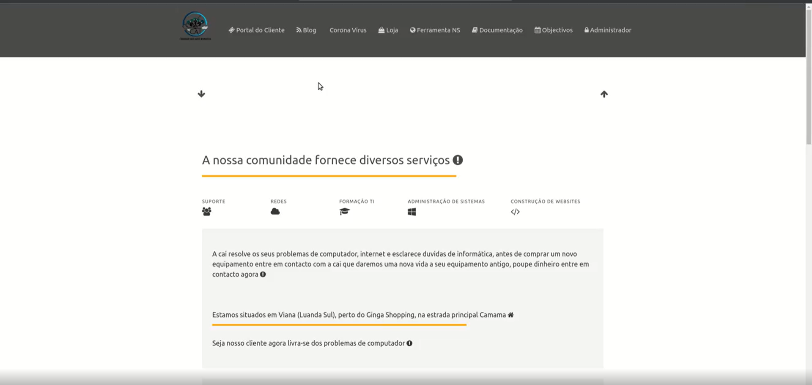

# CAI (Comunidade Angola de Informática ) 

Rails 6 will be upgraded to Rails 8...


CAI (Comunidade Angola de Informática ) is a Africa/Angola IT platform with the goal to bring IT solution together and share to less fortune people that can't have access to these type of information 💻

The app is in Portuguese

In the welcome page we have a display of what types of services we provide:

- Suporte (Support)
- Redes (Networking)
- Formação de TI (IT Teaching)
- Administração de Sistemas (System Administration)
- Construção de Websites (Web Development)

In the Portal do Cliente page you can submit a request for technical support .

You can check our news and most recent technical news world wide at Blog and Hacker news page  .

Check our small eCommerce store at Loja page .

On the Ferramenta NS page you can use nslookup tool's for troubleshoot client's domains .

This application was build with a main focus of helping the Angolan people get access to the recent technologies world wide .	💓



## Run Locally

Clone the project

```bash
  git clone git@github.com:heislerlemos/hlemos.git
```

Go to the project directory

```bash
  cd /app
```

Install dependencies

```bash
  bundle install
```

Start the server

```bash
  rails server
```

